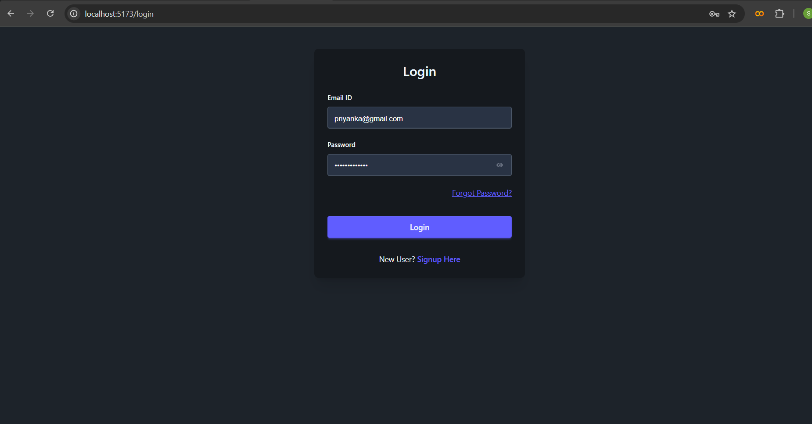
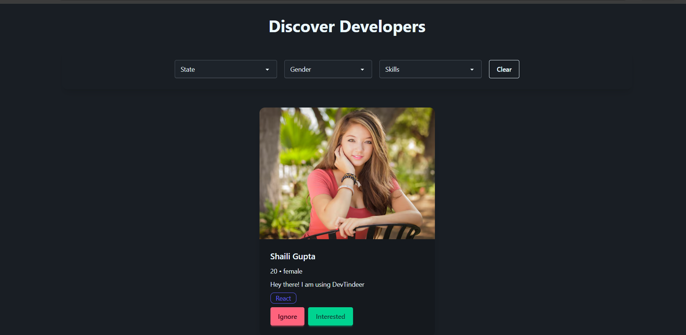
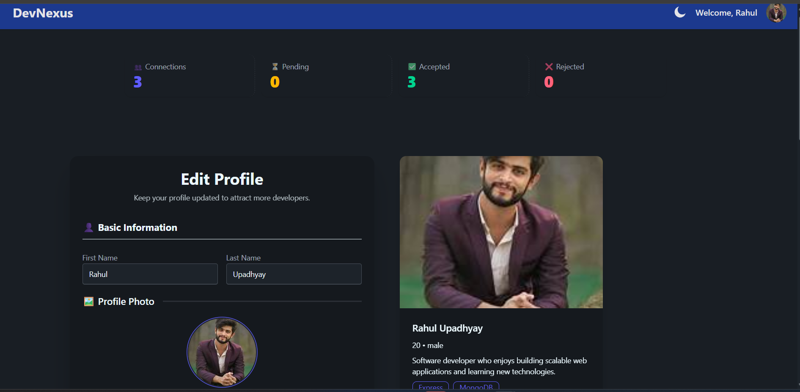
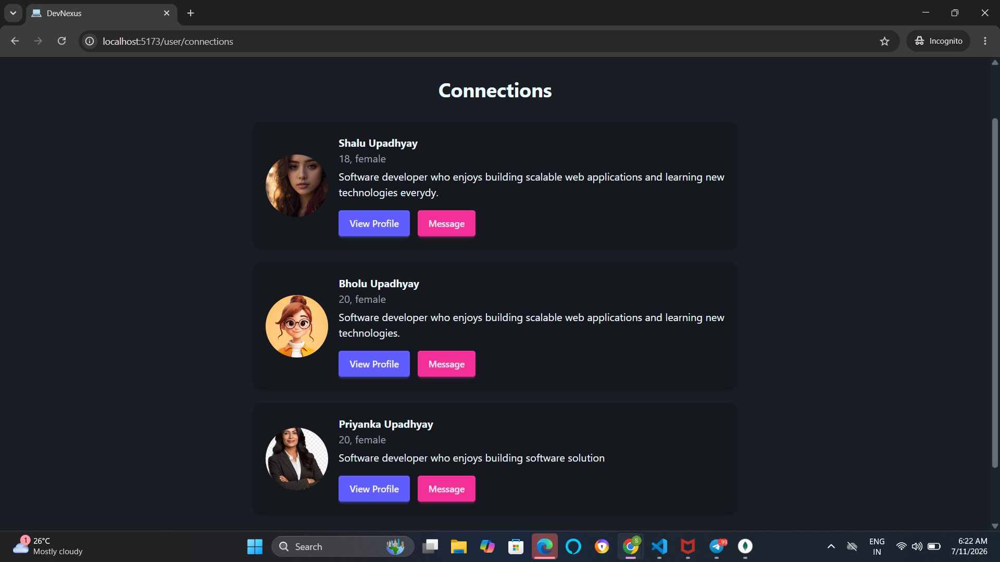
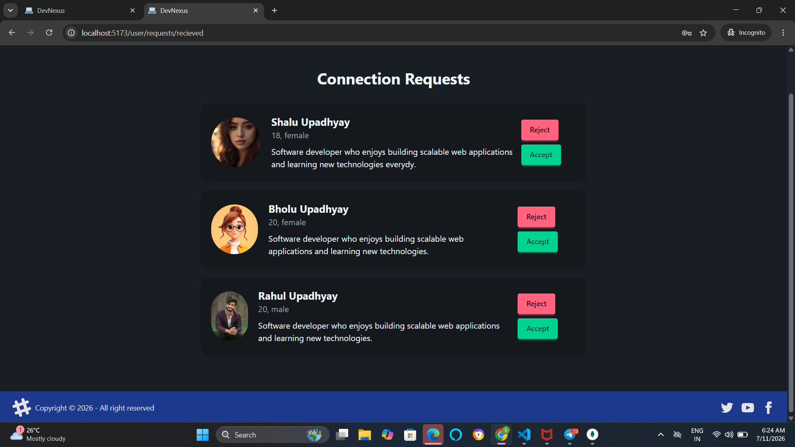
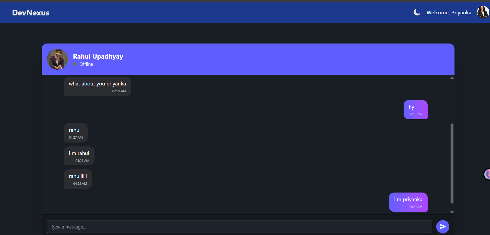

# 🚀 DevNexus Frontend

<div align="center">

### A Modern Developer Networking Platform

Connect • Collaborate • Chat in Real-Time


</div>

---

## 🌟 About

**DevNexus** is a modern full-stack developer networking platform inspired by professional networking applications.

The frontend provides an intuitive and responsive interface where developers can discover other developers, manage professional profiles, send connection requests, and communicate through real-time chat.

The project focuses on clean UI, responsive design, authentication, and seamless user experience.

---

## ✨ Features

### 🔐 Authentication

- User Registration
- Secure Login
- JWT Authentication
- Forgot Password
- OTP Verification
- Reset Password
- Persistent Login Session

---

### 👤 Developer Profiles

- Edit Professional Profile
- Upload Profile Photo
- Live Profile Preview
- Skills
- Education
- Company
- Experience
- About Section
- Social Links
- Profile Completion Indicator

---

### 🤝 Networking

- Browse Developer Feed
- Send Interest
- Ignore Profiles
- Accept Connection Requests
- Reject Connection Requests
- View Connections
- View Developer Profiles

---

### 💬 Real-Time Chat

- Instant Messaging
- Socket.IO Integration
- Modern Chat Interface
- Message Timestamp
- Copy Messages
- Reply Support
- Delete Own Messages
- Message Reactions (UI)

---

### 📧 Notifications

- Forgot Password Emails
- OTP Verification
- Daily Email Notifications
- Connection Updates

---

### 🎨 UI Features

- Fully Responsive Design
- Dark Theme
- Modern Dashboard
- Beautiful Cards
- Dropdown Navigation
- Loading States
- Empty State Screens
- Toast Notifications

---

## 🛠 Tech Stack

| Technology | Purpose |
|------------|---------|
| React | Frontend Library |
| Redux Toolkit | State Management |
| React Router DOM | Routing |
| Axios | API Calls |
| Tailwind CSS | Styling |
| DaisyUI | UI Components |
| Socket.IO Client | Real-Time Chat |
| React Icons | Icons |
| Vite | Build Tool |

---

## 📸 Screenshots

### 🔐 Login

> Add login screenshot here


---

### 🏠 Developer Feed

> Add feed screenshot here


---

### 👤 Edit Profile

> Add profile screenshot here


---

### 🤝 Connections

> Add connections screenshot here


---

### 📨 Connection Requests

> Add request screenshot here


---

### 💬 Chat

> Add chat screenshot here


---

## ⚙️ Installation

Clone the repository

```bash
git clone https://github.com/abcshalini1245/DevNexus-frontend
```

Go inside the project

```bash
cd devnexus-frontend
```

Install dependencies

```bash
npm install
```

Run the development server

```bash
npm run dev
```

---

## 🌍 Environment Variables

Create a `.env` file.

```
VITE_BASE_URL=http://localhost:7777
```

---

## 📱 Responsive Design

✔ Desktop

✔ Laptop

✔ Tablet

✔ Mobile

---

## 🚀 Deployment

The frontend is deployed on **AWS EC2** and served using **Nginx** with a custom domain.

---

## 🔗 Backend Repository

https://github.com/abcshalini1245/DevNexus-Backened

---

## 🌐 Live Demo

http://devnexus.duckdns.org

---

## 🚀 Upcoming Features

- AI Developer Assistant
- Premium Membership
- Razorpay Integration
- Video Calling
- Voice Messages
- Push Notifications
- File Sharing
- Group Chats

---

## 📚 Learning

This project was built while learning advanced backend and full-stack development concepts from **Akshay Saini's Namaste Node.js** course. The frontend UI, features, integrations, and deployment were independently implemented and customized.

---

## 👩‍💻 Author

**Shalini Upadhyay**

M.Tech CSE • NIT Durgapur

GitHub:

https://github.com/abcshalini1245

LinkedIn:

https://www.linkedin.com/in/shalini-upadhyay11/

---

## ⭐ Support

If you like this project, don't forget to ⭐ the repository.